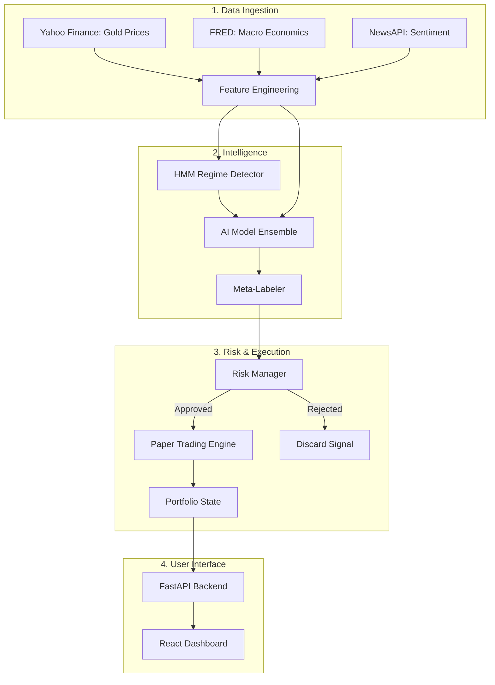

# 🪙 Mini-Medallion: Complete Project Summary (A to Z)

**Mini-Medallion** is an institutional-grade, AI-powered automated trading system specifically designed to trade Gold (XAU/USD). Inspired by Renaissance Technologies' Medallion Fund, it doesn't rely on simple technical indicators; instead, it uses a complex **ensemble of machine learning models**, dynamic risk management, and rigorous statistical validation.

This document breaks down the entire system from A to Z so you understand exactly how data becomes a profitable trade.

---

## 🏗️ System Architecture & Data Flow
Here is exactly what happens every time the trading engine evaluates the market.



---

## 🔄 Step-by-Step: The Anatomy of a Trade

### Step A: Data Ingestion (The Senses)
Before the AI can think, it needs to see. The system constantly pulls in data from three main sources:
1. **Price Data (Yahoo Finance)**: Fetches the latest Open, High, Low, Close, and Volume for Gold futures (`GC=F`).
2. **Macro Data (FRED)**: Fetches interest rates, inflation data, and bond yields to understand the broader economy.
3. **Sentiment Data (NewsAPI)**: Scans financial news headlines to gauge if the market is fearful or greedy.

### Step B: Feature Engineering (The Filter)
Raw data is messy. The system uses **Discrete Wavelet Transforms (DWT)** to strip out random "market noise" and expose the true underlying price trend. It also calculates dozens of technical indicators (Volatility, RSI, MACD).

### Step C: Market Regime Detection (The Context)
The market behaves differently during a crash than during a bull run. The **Hidden Markov Model (HMM)** analyzes the data and declares the current "Regime":
* 🟢 **GROWTH**: Low volatility, steady uptrends.
* 🟡 **NORMAL**: Average volatility, typical trading.
* 🔴 **CRISIS**: High volatility, panic selling.

### Step D: AI Model Ensemble (The Brains)
Instead of relying on one strategy, Mini-Medallion asks **6 different AI models** for their opinion. Each model is a specialist:
1. **Wavelet Model**: Good at finding short-term momentum.
2. **HMM Model**: Good at trading based on volatility.
3. **LSTM (Deep Learning)**: Neural network that finds complex, long-term historical patterns.
4. **TFT (Transformer)**: Modern AI (like ChatGPT) that predicts future price trajectories.
5. **Genetic Algorithm**: Evolves math equations to find hidden rules.
6. **Ensemble**: A master model that listens to all the others.

### Step E: The Meta-Labeler (The Judge)
The models submit their signals (`LONG`, `SHORT`, or `HOLD`) along with a confidence score (e.g., 85%). The **Meta-Labeler** looks at the current Market Regime and decides who to trust. For example, if we are in a `CRISIS` regime, it might ignore the Genetic model and heavily weigh the LSTM model.

### Step F: Risk Management (The Shield)
If the Meta-Labeler outputs a confident `LONG` signal, it doesn't immediately buy. The signal goes to the **Risk Manager**, which checks:
* **Circuit Breakers**: Have we lost too much money today? If yes, `REJECT`.
* **Drawdown Limits**: Is the portfolio down more than 15% from its peak? If yes, `REJECT`.
* **Kelly Sizing**: If the trade is approved, it uses the Kelly Criterion formula to mathematically calculate exactly how much money to risk based on the AI's confidence.

### Step G: Paper Trading Engine (The Hands)
The approved trade is sent to the **Paper Trading Engine** (currently simulating live markets). It executes the trade, updates your available cash balance, and tracks the exact second the position was opened.

### Step H: The Dashboard (The Monitor)
Your React frontend connects to the FastAPI backend via WebSockets. It constantly asks the Paper Trading Engine for updates and beautifully renders the P&L, Equity Curve, and live AI Model Signals on your screen.

---

## 🚀 Current Project Status
You have successfully built and deployed **Phases 1 through 6B**!

✅ **Infrastructure**: Docker, QuestDB (time-series database), and Redis are running.
✅ **Backend API**: FastAPI is running locally and connected to your database.
✅ **Hardware Acceleration**: Successfully configured to use your **NVIDIA RTX 3050 Laptop GPU** via PyTorch CUDA 12.1.
✅ **Frontend**: React Dashboard is successfully communicating with the backend, and UI bugs have been patched.
✅ **Paper Trading**: The simulation engine is active, updating every 60 seconds.

## 💻 How to Start the System
If you ever restart your computer, here are the exact steps to bring your entire trading firm back to life:

**1. Start the Database**
Open Docker Desktop, go to Containers, and start the `jim-questdb-1` and `jim-redis-1` containers.

**2. Start the AI Backend**
Open a terminal, activate your virtual environment, and start the API:
```powershell
.venv\Scripts\python.exe main.py --mode api
```

**3. Start the Dashboard**
Open a new terminal tab, navigate to the dashboard folder, and start the frontend:
```powershell
cd d:\AI\Jim\dashboard
npm run dev
```

**4. Start Trading**
Go to `http://localhost:5173`, click on the **Paper Trading** tab, and click the green **Start Engine** button.
