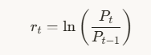
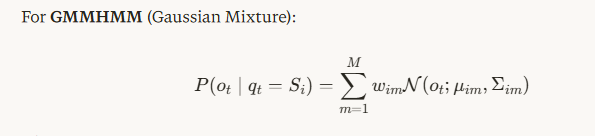

Professional HMM Pipeline for Gold Trading (XAU/USD - USD per Ounce)
Hardware-optimized for AMD Ryzen 9800X3D (CPU) + NVIDIA RTX 5070 Ti (GPU) + 32GB RAM

PHASE 1: PROJECT INFRASTRUCTURE & HARDWARE ALLOCATION
1.1 Hardware Utilization Strategy for XAU/USD Trading

| Hardware Component       | Specifications                                         | Allocation & Purpose                                                                                                                                                                                                                                       |
| ------------------------ | ------------------------------------------------------ | ---------------------------------------------------------------------------------------------------------------------------------------------------------------------------------------------------------------------------------------------------------- |
| CPU: AMD Ryzen 7 9800X3D | 8-core/16-thread, 3D V-Cache (96MB L3), up to 5.2 GHz  | Primary computation: Data preprocessing, feature engineering, Baum-Welch EM algorithm (CPU-optimized), Viterbi decoding, real-time inference. The 3D V-Cache provides ~30% faster matrix operations for sequential HMM computations youtube                |
| GPU: NVIDIA RTX 5070 Ti  | 16GB GDDR7, 8960 CUDA cores, Ada Lovelace architecture | Parallel acceleration: Monte Carlo simulations (10,000+ path simulations), bootstrap resampling for confidence intervals, hyperparameter grid search (K=2 to 8 states), ensemble HMM training (50 models), GPU-accelerated matrix operations via CuPy/cuDF |
| System RAM: 32GB DDR5    | Dual-channel, 5200+ MHz                                | Memory management: 14GB for data pipelines (10-year XAU/USD minute data), 8GB for model parameters & covariance matrices, 6GB buffer for real-time streaming, 4GB OS/cache                                                                                 |

1.2 Software Stack Architecture

| Layer                | Technology                                                                  | Purpose                                           |
| -------------------- | --------------------------------------------------------------------------- | ------------------------------------------------- |
| Core HMM Library     | hmmlearn (GaussianHMM, GMMHMM) or pomegranate (GPU-accelerated, 10× faster) | Model training & inference                        |
| Data Processing      | polars (Rust-based, faster than pandas), numpy, cuDF (GPU)                  | Feature engineering, time-series transformation   |
| Technical Indicators | ta-lib, pandas-ta, custom XAU/USD-specific indicators                       | RSI, MACD, ATR, Bollinger Bands, VIX correlation  |
| Statistical Testing  | scipy.stats, statsmodels (ADF, KPSS), arch (GARCH)                          | Stationarity tests, volatility modeling           |
| Validation           | scikit-learn (TimeSeriesSplit), custom backtesting engine                   | Walk-forward validation, Sharpe ratio calculation |
| Real-time Streaming  | websockets, asyncio, aiohttp                                                | Live XAU/USD price feed (1-second latency)        |
| Experiment Tracking  | MLflow or Weights & Biases                                                  | Hyperparameter logging, model versioning          |
| GPU Acceleration     | CuPy, PyTorch (for matrix ops)                                              | Parallel computation on 5070 Ti instagram         |

1.3 Directory Structure

xauusd_hmm_trading/
├── data/
│   ├── raw/              # Raw XAU/USD OHLCV (Metals-API, TwelveData, Investing.com)
│   ├── processed/        # Cleaned, resampled data (1-min, 5-min, 15-min, 1-hour, daily)
│   ├── features/         # Engineered feature matrices (feature_store.parquet)
│   └── macro/            # USD index (DXY), real yields, VIX, BTC correlation data
├── models/
│   ├── checkpoints/      # Saved HMM parameters per epoch (transition/emission matrices)
│   ├── best/             # Production-ready model (best_sharpe_model.pkl)
│   └── ensemble/         # Ensemble of 10 HMMs for robustness
├── src/
│   ├── data_ingestion/   # API connectors, data validation
│   ├── preprocessing/    # Cleaning, stationarity transformation
│   ├── features/         # Feature engineering pipeline
│   ├── training/         # Baum-Welch, hyperparameter optimization
│   ├── inference/        # Viterbi decoding, real-time signals
│   ├── backtesting/      # Event-driven backtest engine
│   └── risk_management/  # Position sizing, stop-loss logic
├── configs/
│   ├── hmm_config.yaml   # HMM hyperparameters (K, components, covariance)
│   ├── trading_config.yaml # Trading rules, risk limits
│   └── hardware_config.yaml # CPU/GPU allocation settings
├── logs/
│   ├── training_logs/    # MLflow experiment runs
│   └── trading_logs/     # Real-time trade execution logs
└── reports/
    ├── performance/      # Equity curves, drawdown charts
    └── regime_analysis/  # State distribution, transition matrix analysis

PHASE 2: XAU/USD DATA ACQUISITION & MULTI-SOURCE FUSION
2.1 Primary Data Sources (XAU/USD - USD per Ounce)

| Source             | Data Type                 | Frequency                           | Historical Depth | Cost        | Purpose                               |
| ------------------ | ------------------------- | ----------------------------------- | ---------------- | ----------- | ------------------------------------- |
| Metals-API         | XAU/USD spot price        | 1-second, 1-min, 5-min, daily       | Since Jan 2010   | Free/$29/mo | Primary price data metals-api+1       |
| TwelveData         | Gold Spot / USD (XAU/USD) | 1-min, 5-min, 15-min, hourly, daily | 10+ years        | Free/$30/mo | Backup data source twelvedata         |
| Investing.com      | XAU/USD historical data   | 1-min, 5-min, daily                 | 15+ years        | Free        | Manual verification investing         |
| Alpha Vantage      | XAU/USD forex data        | 1-min, 5-min, daily                 | 20 years         | Free/$49/mo | Alternative source                    |
| COMEX Gold Futures | GC1! (Gold Continuous)    | 1-min, 5-min, daily                 | 20+ years        | $10–50/mo   | Futures correlation, arbitrage signal |

2.2 Macro & Cross-Asset Data (Critical for XAU/USD)
XAU/USD is heavily influenced by USD strength, real yields, and risk sentiment. Integrate:

| Data Source                          | Variable                       | Frequency            | Economic Rationale                                         |
| ------------------------------------ | ------------------------------ | -------------------- | ---------------------------------------------------------- |
| Federal Reserve Economic Data (FRED) | 10Y Treasury Real Yield (TIPS) | Daily                | Primary driver: Gold vs. real opportunity cost tradingview |
| FRED                                 | DXY (US Dollar Index)          | 1-min, daily         | Inverse correlation: DXY ↓ → Gold ↑ tradingview            |
| CBOE                                 | VIX (Volatility Index)         | 1-min, 15-min, daily | Risk-on/off: VIX ↑ → Gold ↑ (safe haven)                   |
| CBOE                                 | GVZ (Gold Volatility Index)    | Daily                | Gold-specific volatility regime                            |
| Crypto APIs                          | BTC/USD price                  | 1-min, 5-min         | Risk-on proxy: BTC ↑ may crowds out gold                   |
| COT Reports                          | CFTC Commitment of Traders     | Weekly               | Institutional positioning (commercial vs. non-commercial)  |
| World Gold Council                   | Gold ETF flows                 | Weekly               | Demand indicator                                           |

2.3 Data Collection Pipeline
Step 1: Bulk Historical Download
Download 15 years of XAU/USD data (2011–2026) at 1-minute resolution (~7.8M bars)

Download DXY, VIX, 10Y real yields at matching timestamps

Store in Parquet format (columnar, compressed, ~2GB for 15 years)

Step 2: Live Streaming Setup
WebSocket connection to Metals-API или TradingView for real-time XAU/USD

Latency target: < 500ms from price change to ingestion

Buffer: Keep last 24 hours in memory (RAM) for low-latency feature computation

Step 3: Data Validation & Quality Checks

| Check                | Method                                                | Action on Failure                                    |
| -------------------- | ----------------------------------------------------- | ---------------------------------------------------- |
| Missing Bars         | Gap detection (timestamp diff > 2× expected interval) | Forward-fill for <5 min gaps; drop if >15 min        |
| Outliers             | Hampel filter (3σ threshold, rolling window=30 min)   | Replace with median of surrounding 10 bars           |
| Stale Data           | Volume = 0 (for futures) or no price change > 10 min  | Flag as invalid, interpolate                         |
| Duplicate Timestamps | Check for duplicate indices                           | Keep highest volume / latest price                   |
| Timezone Alignment   | All timestamps in UTC (convert to EST for NY session) | Standardize to UTC for consistency                   |
| Synchronicity        | XAU/USD vs. DXY vs. VIX alignment                     | Resample to common 5-min grid using ohlc aggregation |

2.4 Data Storage Strategy

| Storage Layer | Technology                      | Data Range           | Purpose                                 |
| ------------- | ------------------------------- | -------------------- | --------------------------------------- |
| Hot Storage   | SQLite / PostgreSQL (in-memory) | Last 30 days         | Real-time inference, low-latency access |
| Warm Storage  | Parquet files on NVMe SSD       | Last 2 years         | Training, feature engineering           |
| Cold Storage  | Parquet on HDD / S3             | 15+ years historical | Backtesting, model retraining           |

PHASE 3: PREPROCESSING & STATIONARITY TRANSFORMATION
3.1 Cleaning Operations (XAU/USD Specific)

| Operation              | Method                                                                        | Rationale for Gold                                                                    |
| ---------------------- | ----------------------------------------------------------------------------- | ------------------------------------------------------------------------------------- |
| Missing Value Handling | Forward-fill for <5 min gaps; linear interpolation for 5–15 min; drop >15 min | XAU/USD trades 24/5 (Sunday 6 PM EST – Friday 5 PM EST); gaps indicate market closure |
| Flash Crash Filtering  | Remove bars with price jump > 2% in 1 minute (e.g., 2020 COVID flash crash)   | Eliminates data artifacts, not true market regimes                                    |
| Session Filtering      | Remove NYSE holiday gaps (e.g., Christmas, Independence Day)                  | Gold volume drops 80% on US holidays                                                  |
| Overnight Gap Handling | Special handling for 5 PM EST rollover (daily close)                          | Gold has daily settlement at 5 PM EST; gap may be artificial                          |

3.2 Stationarity Transformation (Critical for HMM)
HMM assumes emissions come from stationary distributions. Raw XAU/USD prices are non-stationary (random walk). Apply:

Primary Transformation: Log Returns
r_t=ln(P_t/P_(t−1))

Why: Log returns are approximately stationary, additive over time

Interpretation: Continuous compounding return (e.g., 0.001 = 0.1% return)

Alternative Transformations (test which works best via AIC/BIC):

| Transformation              | Formula                                                        | When to Use                                       |
| --------------------------- | -------------------------------------------------------------- | ------------------------------------------------- |
| Percentage Returns          | Pt−Pt−1Pt−1\\frac{P_t - P_{t-1}}{P_{t-1}}Pt−1​Pt​−Pt−1​​       | If log returns show residual autocorrelation      |
| First Difference            | Pt−Pt−1P_t - P_{t-1}Pt​−Pt−1​                                  | If price level matters (e.g., support/resistance) |
| Z-Score Normalization       | Pt−μ252σ252\\frac{P_t - \\mu_{252}}{\\sigma_{252}}σ252​Pt​−μ252​​ | Rolling window (252 bars ≈ 1 day for 5-min data)  |
| Volatility-Adjusted Returns | rtRV20\\frac{r_t}{\\text{RV}_{20}}RV20​rt​​                    | Normalize by 20-period realized volatility        |

Stationarity Verification:
Augmented Dickey-Fuller (ADF) Test:

Null hypothesis: Time series has a unit root (non-stationary)

Target: p-value < 0.05 (reject null → stationary)

Apply to log returns; if p > 0.05, apply differencing again

KPSS Test (complementary to ADF):

Null hypothesis: Time series is stationary

Target: p-value > 0.05 (fail to reject null → stationary)

Visual Inspection:

Plot rolling mean & rolling std (window=252 bars)

Stationary series should have constant mean & variance over time

3.3 Normalization & Scaling

| Method                    | Formula                                                             | When to Use                                               |
| ------------------------- | ------------------------------------------------------------------- | --------------------------------------------------------- |
| Standardization (Z-score) | z=x−μσz = \\frac{x - \\mu}{\\sigma}z=σx−μ​                          | Default: Fit μ, σ on training set only; apply to val/test |
| Robust Scaling            | z=x−medianIQRz = \\frac{x - \\text{median}}{\\text{IQR}}z=IQRx−median​ | If outliers persist after Hampel filter                   |
| Min-Max Scaling           | x′=x−min⁡max⁡−min⁡x' = \\frac{x - \\min}{\\max - \\min}x′=max−minx−min​ | For bounded features (e.g., RSI ∈ )                       |
| Fractional Change         | xt−xt−1xt−1\\frac{x_t - x_{t-1}}{x_{t-1}}xt−1​xt​−xt−1​​            | For features like volume, open interest                   |

Critical: Never fit scaler on test data (looks into future = look-ahead bias).

PHASE 4: FEATURE ENGINEERING (XAU/USD SPECIFIC)
Key Insight: In financial ML, feature engineering matters more than model architecture. For XAU/USD, incorporate both technical indicators and macro fundamentals.

4.1 Core Feature Categories for XAU/USD
A. Price-Based Features (Raw Signal)

| Feature          | Formula                                                             | Window | Economic Meaning                            |
| ---------------- | ------------------------------------------------------------------- | ------ | ------------------------------------------- |
| Log Return       | ln⁡(Pt/Pt−1)\\ln(P_t/P_{t-1})ln(Pt​/Pt−1​)                          | 1      | Instantaneous change (primary signal)       |
| 5-period Return  | ln⁡(Pt/Pt−5)\\ln(P_t/P_{t-5})ln(Pt​/Pt−5​)                          | 5      | Short-term momentum (25 min for 5-min data) |
| 20-period Return | ln⁡(Pt/Pt−20)\\ln(P_t/P_{t-20})ln(Pt​/Pt−20​)                       | 20     | Medium-term trend (1 hour for 5-min data)   |
| 60-period Return | ln⁡(Pt/Pt−60)\\ln(P_t/P_{t-60})ln(Pt​/Pt−60​)                       | 60     | Long-term trend (5 hours for 5-min data)    |
| Price Position   | Pt−L20H20−L20\\frac{P_t - L_{20}}{H_{20} - L_{20}}H20​−L20​Pt​−L20​​ | 20     | Relative price level (0–1 range)            |
| Log Price Level  | ln⁡(Pt)\\ln(P_t)ln(Pt​)                                             | —      | For mean-reversion detection                |

B. Volatility Features (Regime Indicator)

| Feature                    | Formula                                                                              | Window | Economic Meaning                             |
| -------------------------- | ------------------------------------------------------------------------------------ | ------ | -------------------------------------------- |
| Realized Volatility (RV)   | 1n∑i=0n−1rt−i2\\sqrt{\\frac{1}{n}\\sum_{i=0}^{n-1} r_{t-i}^2}n1​∑i=0n−1​rt−i2​​      | 20     | Current volatility (annualize: ×√252×√24)    |
| ATR (Average True Range)   | ta-lib.ATR(high, low, close)                                                         | 14     | Volatility measure (in USD/oz)               |
| Bollinger Band Width       | BBupper−BBlowerSMA20\\frac{BB_{upper} - BB_{lower}}{SMA_{20}}SMA20​BBupper​−BBlower​​ | 20     | Volatility expansion/contraction             |
| Volatility Ratio           | RV5RV20\\frac{RV_{5}}{RV_{20}}RV20​RV5​​                                             | 5/20   | Volatility change (sudden spike detection)   |
| GARCH(1,1) Conditional Vol | arch.arch_model().fit()                                                              | —      | Modeled volatility (captures clustering)     |
| GVZ (Gold Vol Index)       | CBOE GVZ data                                                                        | Daily  | Gold-specific implied volatility tradingview |

C. Momentum Indicators (Trend Strength)

| Feature              | Formula                                                                           | Window | Economic Meaning                  |
| -------------------- | --------------------------------------------------------------------------------- | ------ | --------------------------------- |
| RSI                  | ta-lib.RSI() (Wilder's smoothing)                                                 | 14     | Overbought (>70) / oversold (<30) |
| MACD                 | EMA12−EMA26EMA_{12} - EMA_{26}EMA12​−EMA26​                                       | 12/26  | Trend momentum                    |
| MACD Signal          | MACD − Signal(9)                                                                  | 9      | Momentum crossover                |
| MACD Histogram       | MACD − Signal                                                                     | 9      | Momentum acceleration             |
| Stochastic %K        | C−L14H14−L14×100\\frac{C - L_{14}}{H_{14} - L_{14}} \\times 100H14​−L14​C−L14​​×100 | 14     | Momentum position                 |
| ROC (Rate of Change) | Pt−Pt−10Pt−10\\frac{P_t - P_{t-10}}{P_{t-10}}Pt−10​Pt​−Pt−10​​                    | 10     | Speed of movement                 |
| Price Momentum       | Pt−Pt−20P_t - P_{t-20}Pt​−Pt−20​                                                  | 20     | Absolute momentum (in USD/oz)     |

D. Volume & Liquidity Features

| Feature                 | Formula                                                                      | Window   | Economic Meaning                         |
| ----------------------- | ---------------------------------------------------------------------------- | -------- | ---------------------------------------- |
| Volume Ratio            | VoltSMA(Vol,20)\\frac{Vol_t}{SMA(Vol, 20)}SMA(Vol,20)Volt​​                  | 20       | Unusual volume (spike detection)         |
| OBV (On-Balance Volume) | Cumulative signed volume                                                     | 20       | Money flow (bullish if OBV ↑)            |
| VWAP Deviation          | Pt−VWAPtVWAPt\\frac{P_t - VWAP_t}{VWAP_t}VWAPt​Pt​−VWAPt​​                   | Intraday | Fair value gap (vs. volume-weighted avg) |
| Volume-Weighted Return  | rt×VoltSMA(Vol,20)r_t \\times \\frac{Vol_t}{SMA(Vol, 20)}rt​×SMA(Vol,20)Volt​​ | 20       | Volume confirmation of price move        |

Note: For spot XAU/USD (no volume), use COMEX gold futures volume as proxy.

E. Macro & Cross-Asset Features (XAU/USD Specific)

| Feature           | Source          | Formula                                                             | Economic Rationale                                       |
| ----------------- | --------------- | ------------------------------------------------------------------- | -------------------------------------------------------- |
| DXY Return        | US Dollar Index | ln⁡(DXYt/DXYt−1)\\ln(DXY_t/DXY_{t-1})ln(DXYt​/DXYt−1​)              | Inverse correlation: DXY ↓ → Gold ↑ tradingview          |
| DXY RSI           | US Dollar Index | ta-lib.RSI(DXY)                                                     | Overbought DXY → Gold bullish                            |
| 10Y Real Yield    | FRED (TIPS)     | Real Yieldt\\text{Real Yield}_tReal Yieldt​                         | Primary driver: Real yield ↑ → Gold ↓ (opportunity cost) |
| Real Yield Change | FRED            | Yieldt−Yieldt−1\\text{Yield}_t - \\text{Yield}_{t-1}Yieldt​−Yieldt−1​ | Sudden yield spike → Gold sell-off                       |
| VIX Return        | CBOE VIX        | ln⁡(VIXt/VIXt−1)\\ln(VIX_t/VIX_{t-1})ln(VIXt​/VIXt−1​)              | VIX ↑ → Gold ↑ (safe-haven demand)                       |
| VIX / Gold Ratio  | VIX / XAU       | VIXtXAUt\\frac{VIX_t}{XAU_t}XAUt​VIXt​​                             | Fear-adjusted gold price                                 |
| BTC Return        | Crypto          | ln⁡(BTCt/BTCt−1)\\ln(BTC_t/BTC_{t-1})ln(BTCt​/BTCt−1​)              | Risk-on proxy; BTC ↑ may crowds out gold                 |
| COMEX-Gold Spread | COMEX − Spot    | COMEXt−Spott\\text{COMEX}_t - \\text{Spot}_tCOMEXt​−Spott​          | Arbitrage signal (futures vs. spot)                      |

F. Lag Features (Temporal Memory)

| Feature  | Description                                                                           |
| -------- | ------------------------------------------------------------------------------------- |
| Lag 1–5  | rt−1,rt−2,…,rt−5r_{t-1}, r_{t-2}, \\dots, r_{t-5}rt−1​,rt−2​,…,rt−5​ (recent momentum) |
| Lag 20   | rt−20r_{t-20}rt−20​ (1-hour lag for 5-min data)                                       |
| Lag 192  | rt−192r_{t-192}rt−192​ (same time yesterday for 5-min data: 192 × 5 min = 16 hours)   |
| Lag 1152 | rt−1152r_{t-1152}rt−1152​ (same time last week for 5-min data)                        |

G. Rolling Statistics (Local Context)

| Feature                   | Window | Formula                                                                        |
| ------------------------- | ------ | ------------------------------------------------------------------------------ |
| Rolling Mean              | 20     | 120∑i=019rt−i\\frac{1}{20}\\sum_{i=0}^{19} r_{t-i}201​∑i=019​rt−i​             |
| Rolling Std               | 20     | 119∑(rt−i−rˉ)2\\sqrt{\\frac{1}{19}\\sum (r_{t-i} - \\bar{r})^2}191​∑(rt−i​−rˉ)2​ |
| Rolling Skew              | 60     | Third moment of returns (asymmetry)                                            |
| Rolling Kurtosis          | 60     | Fourth moment (tail risk, fat tails)                                           |
| Rolling Min/Max           | 20     | Range over window (support/resistance)                                         |
| Rolling Correlation (DXY) | 60     | corr(rgold,rDXY)\\text{corr}(r_{\\text{gold}}, r_{\\text{DXY}})corr(rgold​,rDXY​) |

H. Session & Time Features (Gold Trading Hours)

| Feature             | Description                                                         |
| ------------------- | ------------------------------------------------------------------- |
| Hour of Day         | 0–23 (UTC); gold is most active during NY session (13:00–21:00 UTC) |
| Day of Week         | 0–4 (Mon–Fri); avoid weekend gaps                                   |
| US Session Flag     | 1 if 13:00–21:00 UTC (NY open), 0 otherwise                         |
| London Session Flag | 1 if 07:00–16:00 UTC (London open), 0 otherwise                     |
| Asian Session Flag  | 1 if 00:00–08:00 UTC (Tokyo/Sydney), 0 otherwise                    |
| US Holiday Flag     | 1 on US holidays (low volume, high gap risk)                        |

4.2 Feature Selection & Dimensionality Reduction
Step 1: Correlation Filtering
Compute correlation matrix of all features

Remove features with |corr| > 0.95 (multicollinearity)

Keep the feature with higher information ratio (corr with target / std)

Step 2: Feature Importance Ranking
Train a Random Forest (100 trees) to predict next-bar return

Rank features by mean decrease in impurity

Keep top 20–25 features (balance between information and overfitting)

Step 3: Domain-Knowledge Retention
Retain economically meaningful features even if statistically weak:

DXY return (inverse correlation is fundamental)

10Y real yield (primary driver of gold)

Volatility features (regime indicator)

Step 4: Optional PCA
If >30 features, apply PCA to reduce to 10–15 principal components

Retain components explaining ≥95% variance

Caution: PCA components are less interpretable than raw features

4.3 Final Feature Matrix Structure

Shape: [T_samples, N_features]
Example (5-min XAU/USD, 25 features):

Index: 2026-05-30 10:15:00 UTC
[
  log_return_1, log_return_5, log_return_20, log_return_60,
  realized_vol_20, ATR_14, bb_width_20, vol_ratio_20,
  RSI_14, MACD, MACD_signal, MACD_histogram, ROC_10,
  DXY_return, DXY_RSI, real_yield_10y, VIX_return,
  volume_ratio_20, OBV_20, vwap_deviation,
  lag_return_1, lag_return_5, lag_return_20, lag_return_192,
  rolling_mean_20, hour_of_day
]

PHASE 5: HMM ARCHITECTURE DESIGN FOR XAU/USD
5.1 Model Type Selection
Recommended: Gaussian Mixture HMM (GMMHMM) with Diagonal Covariance

| Model Type                | Pros                                                                            | Cons                                                | When to Use for XAU/USD                                 |
| ------------------------- | ------------------------------------------------------------------------------- | --------------------------------------------------- | ------------------------------------------------------- |
| GaussianHMM               | Fast, interpretable, 3 states                                                   | Assumes unimodal emissions per state                | Baseline model, simple regime detection                 |
| GMMHMM (Gaussian Mixture) | Captures multimodal emissions (e.g., gold can be bullish for different reasons) | Slower, more parameters (2–3×)                      | Production choice: Complex XAU/USD regimes quantconnect |
| Bayesian HMM              | Uncertainty quantification on parameters                                        | Very slow (MCMC sampling), data-hungry              | Research mode, not production                           |
| Coupled HMM (CHMM)        | Models XAU/USD + DXY + VIX jointly                                              | Complex, requires synchronized data                 | Multi-asset strategy, intermarket analysis arxiv        |
| Multivariate HMM          | Models multiple assets jointly                                                  | Computationally expensive (covariance matrix O(N²)) | Gold + Silver + DXY portfolio                           |

Production Choice: GMMHMM with 2–3 mixture components per state for capturing XAU/USD's multimodal distribution.

5.2 Number of Hidden States (K) for XAU/USD
Gold trading regimes typically include:

| State              | Interpretation     | XAU/USD Characteristics                                                                    |
| ------------------ | ------------------ | ------------------------------------------------------------------------------------------ |
| State 0            | Bullish / High Vol | Upward trend (>0.5% daily), high RV (>15% annualized), breakout mode, DXY ↓, real yields ↓ |
| State 1            | Neutral / Low Vol  | Range-bound (±0.2% daily), low RV (<10% annualized), consolidation, DXY sideways           |
| State 2            | Bearish / High Vol | Downward trend (<-0.5% daily), high RV (>15% annualized), panic mode, DXY ↑, real yields ↑ |
| State 3 (optional) | Trend Reversal     | Transition state, mixed signals, high uncertainty, VIX spike                               |
| State 4 (optional) | Macro Shock        | Extreme volatility (>3% daily), news-driven (Fed announcement, geopolitical crisis)        |

Optimal K Determination:
Grid Search: Train models with K ∈ {2, 3, 4, 5, 6}

Model Selection Criteria:

AIC (Akaike Information Criterion): 
AIC=2k−2ln(L), lower is better

BIC (Bayesian Information Criterion): 
BIC=kln(n)−2ln(L), lower is better, penalizes complexity more

Log-Likelihood: Higher is better (but overfits if K too large)

ICS (Integrated Completed Likelihood): Alternative to BIC

ELBO (if using variational Bayes)

Select K where BIC reaches minimum (elbow method)

Typical Optimal K for XAU/USD: 3–5 states

5.3 HMM Mathematical Formulation for XAU/USD

Parameters to Learn:
Initial State Distribution π:  
π(i)=P(q1=S(i))
where q1 is the first hidden state (e.g., start of trading day).

Transition Probability Matrix A(K×K):
A_ij=P(q_(t+1)=S_j ∣ q_t=S_i)
​
Row-stochastic: ∑_j A_ij=1
Captures regime persistence (e.g., Bullish → Bullish probability often >80%)
Asymmetric transitions (Bull → Bear vs. Bear → Bull may differ)

Emission Probabilities B: For GaussianHMM:

P(o_t∣q_t=S_i)=N(o_t;μ_i,Σ_i)
where: μ_i : mean vector for state i (shape: N_features, e.g., 25)
Σ_i : covariance matrix for state i (shape: N_features×N_features)
Use diagonal covariance to reduce parameters (assume feature independence within state)

For GMMHMM (Gaussian Mixture):

where:

M = number of mixture components (typically 2–3)

w_im : weight of mixture m in state i (sums to 1)

Captures multimodal emissions (e.g., gold can be bullish due to DXY ↓ OR VIX ↑)

5.4 Architecture Configuration (Production for XAU/USD)

hmm_config:
  model_type: "GMMHMM"
  n_states: 4              # Bull, Neutral, Bear, Reversal (optimal for XAU/USD)
  n_components: 3          # Mixture components per state (capturing multimodal emissions)
  covariance_type: "diag"  # Diagonal covariance (reduces parameters, faster)
  algorithm: "baum_welch"  # EM algorithm (standard for HMM)
  max_iter: 200            # Convergence iterations (prevent overfitting)
  tol: 1e-4                # Convergence tolerance (log-likelihood change)
  init_params: "st"        # Initialize from data (not random): 's'=states, 't'=transitions
  random_state: 42         # Reproducibility
  min_covariance: 1e-3     # Regularization (prevent degenerate Gaussians)

  PHASE 6: TRAINING PIPELINE (BAUM-WELCH ALGORITHM)
6.1 Train-Validation-Test Split (Time-Series Split)

| Split      | Time Range (XAU/USD)                             | Purpose                               | Size |
| ---------- | ------------------------------------------------ | ------------------------------------- | ---- |
| Training   | 2015–2023 (daily), or 2023–2025 (minute)         | Parameter estimation (Baum-Welch)     | 70%  |
| Validation | 2024 (daily), or last 6 months (minute)          | Hyperparameter tuning (K, components) | 15%  |
| Test       | 2025–May 2026 (daily), or last 3 months (minute) | Final evaluation (out-of-sample)      | 15%  |

Critical Rules:

No random shuffling: Maintain temporal order

No look-ahead bias: Never train on future data

Gap between splits: Leave 1-week gap between train/val to prevent leakage

6.2 Walk-Forward Validation (Rolling Window)
For robust evaluation and избежать overfitting:

Window 1: Train [2015–2018] → Validate [2019]
Window 2: Train [2016–2019] → Validate [2020]
Window 3: Train [2017–2020] → Validate [2021]
Window 4: Train [2018–2021] → Validate [2022]
Window 5: Train [2019–2022] → Validate [2023]
Window 6: Train [2020–2023] → Validate [2024]
Window 7: Train [2021–2024] → Validate [2025]

Repeat for 7–10 windows to ensure model stability across market regimes (bull, bear, COVID, Fed hiking cycle).

6.3 Baum-Welch (EM Algorithm) Detailed Steps
E-Step (Expectation): Compute posteriors
Forward Algorithm (α) - compute probability of observations up to time t:

α_t(i)=P(o_1 ,o_2 ,…,o_t,q_t =S_i ∣ λ)

Base case: α_t(i)=π_i⋅b_i(o_1)
Recursion: α_(t+1)(j)=[∑_i α_t(i).A_(ij)]⋅b_j(o_t+1)
Log-space: Use log-sum-exp trick to avoid underflow

Backward Algorithm (β) - compute probability of future observations:
β_t(i)=P(o_(t+1),…,o_T ∣ q_t =S_i ,λ)
Base case: β_t(i)=1
Recursion: β_t(i)=∑_j A_(ij)⋅b_j(o_(t+1))⋅β_t+1(j)

State Posterior (γ) - probability of being in state i at time t:

γ_t(i)=P(q_t=S_i ∣ o,λ) = [α_t(i).β_t(i)] / ∑_j α_t(j).β_t(j)

Transition Posterior (ξ) - probability of transitioning from i to j:

ξ_t(i,j)=P(q_t=S_i,q_(t+1)=S_j ∣ o,λ)
ξ_t(i,j)= [α_t(i).A_(ij).b_j(o_(t+1)).β_t+1(j)] / ∑_i ∑_j α_t(i).A_(ij).b_j(o_(t+1)).β_t+1(j)

M-Step (Maximization): Update parameters
Update initial state distribution π:
π_i=γ_1(i)

Update transition matrix A:
A_ij = {(upperLimit (T-1))∑_(t=1) ξ_t(i,j)} / {(upperLimit (T-1))∑_(t=1) γ_t(i)}

Update mean μ (for each state):
μ_i = [(upperLimit (T)∑_(t=1) γ_t(i).o_t] / [(upperLimit (T)∑_(t=1) γ_t(i)]

Update covariance Σ:
Σ_i = [(upperLimit (T)∑_(t=1) γ_t(i).(o_t−μ_i)(o_t−μ_i)^T)] / [(upperLimit (T)∑_(t=1) γ_t(i)]
For diagonal covariance: only compute diagonal elements
If diagonal covariance: Σ_i = diag(σ_1^2,σ_2^2,...,σ_n^2)

Regularization: Add small value to diagonal to prevent degenerate Gaussians (prevent overfitting).

Convergence Check: Repeat until log-likelihood converges (increase < tolerance).

Update GMM mixture weights (if GMMHMM):
w_im = [upperLimit (T)∑_(t=1) γ_t(i,m)] / [upperLimit (T)∑_(t=1) γ_t(i)]

Update GMM μ and Σ for each mixture component similarly.

Repeat E-step and M-step until:

Convergence: Change in log-likelihood < tolerance (1e-4)

Max iterations: 200 (prevent overfitting)

Early stopping: If validation log-likelihood decreases for 10 consecutive iterations

6.4 Training Optimization for Your Hardware (9800X3D + 5070 Ti)

| Optimization        | CPU (9800X3D)                                             | GPU (5070 Ti)                                                             |
| ------------------- | --------------------------------------------------------- | ------------------------------------------------------------------------- |
| Parallelization     | Multi-thread Baum-Welch (n_jobs=14, use 14 of 16 threads) | GPU-accelerated matrix ops via CuPy or pomegranate (10× faster) instagram |
| Batch Training      | Train on 20,000 samples per batch (1-week of 5-min data)  | GPU handles 200k+ samples batch (1 month of 5-min data)                   |
| Hyperparameter Grid | Sequential K search (K=2, 3, 4, 5, 6)                     | Parallel grid search across K, components, covariance types               |
| Bootstrap Ensembles | 10 models on CPU (different seeds)                        | 50 models on GPU for ensemble (robustness)                                |
| Memory Management   | Use polars (lazy evaluation) for large datasets           | Use CuPy arrays for GPU memory efficiency                                 |

6.5 Regularization & Overfitting Prevention

| Technique                       | Implementation                                                                      | Effect                                             |
| ------------------------------- | ----------------------------------------------------------------------------------- | -------------------------------------------------- |
| L2 Regularization on Covariance | Add small λI to Σ (λ = 1e-3)                                                        | Prevents degenerate Gaussians (zero variance)      |
| Early Stopping                  | Monitor validation log-likelihood; stop if no improvement for 10 iterations         | Prevents overfitting to training data              |
| Parameter Constraints           | Minimum variance per state (σ > 1e-4); minimum transition probability (A_ij > 0.01) | Prevents absorbing states or vanishing transitions |
| Dropout on Features             | Randomly drop 10% of features during training (variant)                             | Reduces feature co-adaptation                      |
| Bayesian Prior                  | Place Dirichlet prior on π and A; Normal-Inverse-Wishart prior on μ, Σ              | Regularizes with prior knowledge                   |

PHASE 7: MODEL EVALUATION & VALIDATION
7.1 Quantitative Metrics
A. Log-Likelihood Metrics

| Metric                    | Formula                                                                  | Target for XAU/USD                            |
| ------------------------- | ------------------------------------------------------------------------ | --------------------------------------------- |
| Training Log-Likelihood   | log⁡P(O∣λtrain)\\log P(O \\mid \\lambda_{\\text{train}})logP(O∣λtrain​)  | High (but watch for overfitting)              |
| Validation Log-Likelihood | log⁡P(O∣λval)\\log P(O \\mid \\lambda_{\\text{val}})logP(O∣λval​)        | High, within 5% of training                   |
| Test Log-Likelihood       | log⁡P(O∣λtest)\\log P(O \\mid \\lambda_{\\text{test}})logP(O∣λtest​)     | High, within 10% of training (generalization) |
| Perplexity                | exp⁡(−1Tlog⁡P(O))\\exp\\left(-\\frac{1}{T} \\log P(O)\\right)exp(−T1​logP(O)) | Low (< 5 for XAU/USD returns)                 |

Overfitting Check: If training LL >> validation LL (e.g., 20% gap), reduce model complexity (fewer states/components, more regularization).

B. State Interpretability Metrics
State Duration Distribution:

Expected duration in state i: E[d_i] = 1 / (1 - A_ii) 
Bullish regime should last days/weeks (e.g., 5–20 days for daily data, 100–500 bars for 5-min data)

If duration < 10 bars, regime is too noisy (increase K or add regularization)

State Transition Matrix Analysis:

High diagonal values (A_ii > 0.8): Regimes are persistent (good, matches economic intuition)

Asymmetric transitions: e.g., Bull → Bear (0.15) > Bear → Bull (0.10) reflects market crash faster than recovery

Visually inspect: Transition matrix heatmap

Emission Distribution Analysis:

Plot histogram of emissions per state (e.g., return distribution for State 0, 1, 2)

Verify each state has distinct mean/volatility profile:

State 0 (Bull): mean > 0, moderate vol

State 1 (Neutral): mean ≈ 0, low vol

State 2 (Bear): mean < 0, moderate/high vol

Use KL divergence between state distributions (higher = better separation)

C. Trading Performance Metrics (Backtesting)

| Metric             | Formula                                                                                                                        | Target for XAU/USD                             |
| ------------------ | ------------------------------------------------------------------------------------------------------------------------------ | ---------------------------------------------- |
| Sharpe Ratio       | E[Rp−Rf]σp\\frac{E[R_p - R_f]}{\\sigma_p}σp​E[Rp​−Rf​]​                                                                        | > 1.5 (annualized, R_f = 0 for simplicity)     |
| Sortino Ratio      | E[Rp−Rf]σdownside\\frac{E[R_p - R_f]}{\\sigma_{\\text{downside}}}σdownside​E[Rp​−Rf​]​                                         | > 2.0 (focus on downside risk)                 |
| Max Drawdown       | max⁡(peak−trough)\\max(\\text{peak} - \\text{trough})max(peak−trough)                                                          | < 15% (XAU/USD is less volatile than equities) |
| Win Rate           | Winning TradesTotal Trades\\frac{\\text{Winning Trades}}{\\text{Total Trades}}Total TradesWinning Trades​                      | > 55%                                          |
| Profit Factor      | Gross ProfitGross Loss\\frac{\\text{Gross Profit}}{\\text{Gross Loss}}Gross LossGross Profit​                                  | > 1.5                                          |
| Calmar Ratio       | Annual ReturnMax Drawdown\\frac{\\text{Annual Return}}{\\text{Max Drawdown}}Max DrawdownAnnual Return​                         | > 1.0                                          |
| Omega Ratio        | Probability(Gain)Probability(Loss)\\frac{\\text{Probability(Gain)}}{\\text{Probability(Loss)}}Probability(Loss)Probability(Gain)​ | > 1.2                                          |
| Gain-to-Pain Ratio | Total ProfitsTotal Losses\\frac{\\text{Total Profits}}{\\text{Total Losses}}Total LossesTotal Profits​                         | > 1.5                                          |

7.2 Regime Classification Quality
Silhouette Score: Measure separation between state clusters (higher = better, target > 0.25)

Confusion Matrix: If using labeled regimes (e.g., from expert annotation of bull/bear markets)

State Predictability: Use Viterbi path vs. true path (if supervised labels exist)

7.3 Baseline Comparison
Compare HMM against:

| Benchmark            | Description                  | Target Outperformance                                     |
| -------------------- | ---------------------------- | --------------------------------------------------------- |
| Buy-and-Hold XAU/USD | Long gold since 2015         | Sharpe > 1.2 vs. benchmark                                |
| SMA Crossover        | 20/50-bar moving average     | Sharpe > 1.5 vs. benchmark                                |
| ARIMA/GARCH          | Classical time-series model  | Lower RMSE, higher Sharpe                                 |
| LSTM/GRU             | Deep learning model github+1 | Similar or better Sharpe, faster inference                |
| Random Forest        | Supervised ML model          | HMM should excel in regime detection, not just prediction |

Success Criteria: HMM should outperform benchmarks in risk-adjusted returns (Sharpe, Sortino), not just raw returns.

7.4 Statistical Significance Testing
Diebold-Mariano Test: Compare forecast accuracy vs. benchmarks (null: equal accuracy)

Bootstrap Confidence Intervals: 1000 resamples for Sharpe ratio CI (95% CI should not include 0)

White's Reality Check: Test if outperformance is not data-snooping (joint test of all benchmarks)

PHASE 8: INFERENCE & REAL-TIME TRADING SIGNALS FOR XAU/USD
8.1 Viterbi Algorithm (Decoding Most Probable State Path)
Given observations  O=(o_1,o_2,…,o_T) and trained model λ:

Goal: Find  Q∗=(q_1^∗,q_2^∗,…,q_T^∗) that maximizes P(Q∣O,λ):

Steps:

Initialization:
δ_1(i)=π_i⋅b_i(o_1),ψ_1(i)=0

Recursion (for t = 2 to T):

δ_t(j)=max_i[δ_{t-1}(i)⋅A_{ij}]⋅b_j(o_t)

ψ_t(j)=argmax_i[δ_{t−1}(i)⋅Aij]

Termination:
q_T^∗=argmax_iδ_T(i)

Backtracking (for t = T-1 to 1):
q_t^∗=ψ_(t+1)(q_(t+1)^∗)

Output: Most likely state sequence Q∗.

Latency: < 10ms on 9800X3D for 1000 bars.

8.2 Posterior State Probability (Alternative to Viterbi)
For real-time inference, compute state posterior at each time step:

P
(
q
t
=
S
i
∣
O
,
λ
)
=
γ
t
(
i
)
P(q 
t
​
 =S 
i
​
 ∣O,λ)=γ 
t
​
 (i)
Use this for confidence scores:

Example: State 0 (Bullish): 85%, State 1 (Neutral): 10%, State 2 (Bearish): 5%

Trade only if confidence > 70% (max posterior probability)

8.3 One-Step-Ahead Prediction for XAU/USD
Predict next state and next observation:

Next State Probability:

P(q_(T+1)=S_j∣O)=∑_i P(q_(T+1)=S_j∣q_T=S_i)⋅P(q_T=S_i∣O) = ∑_iA_ij⋅γ_T(i)

Next Observation (Expected Return):
E[o_(T+1)∣O]=∑_j P(q_(T+1)=S_j∣O)⋅μ_j 
 
Next Price Prediction:
P_(T+1)= P_T⋅exp(E[o_(T+1)∣O])

8.4 Trading Signal Generation (XAU/USD Specific)
State → Action Mapping

| Current State | Next State Probability | Action               | Position Size | Stop-Loss        | Take-Profit    |
| ------------- | ---------------------- | -------------------- | ------------- | ---------------- | -------------- |
| Bullish (0)   | >70% → Bullish         | BUY XAU/USD          | 1.0× (full)   | 1.5% below entry | 3% above entry |
| Bullish (0)   | >50% → Neutral         | HOLD (reduce)        | 0.5× (half)   | Trailing 1%      | —              |
| Bullish (0)   | >50% → Bearish         | SELL (exit)          | 0× (flat)     | Market close     | —              |
| Neutral (1)   | >60% → Bullish         | BUY (partial)        | 0.5×          | 2% below entry   | 2% above       |
| Neutral (1)   | >60% → Bearish         | SELL/SHORT (partial) | -0.5×         | 2% above entry   | 2% below       |
| Neutral (1)   | Mixed (no >50%)        | HOLD/CASH            | 0×            | —                | —              |
| Bearish (2)   | >70% → Bearish         | SHORT XAU/USD        | 1.0×          | 1.5% above entry | 3% below entry |
| Bearish (2)   | >50% → Bullish         | COVER (exit)         | 0× (flat)     | Market close     | —              |
| Reversal (3)  | High uncertainty       | REDUCE POSITION      | 0.25×         | Tight 0.5%       | Tight 1%       |

Signal Confidence Filter
Only trade if state confidence > 70% (max posterior probability)

If confidence < 50%, stay in cash (no trade)

State transition warning: If state changes 3+ times in 1 hour, pause trading (market unstable)

8.5 Real-Time Inference Pipeline Architecture

Live XAU/USD Data Stream (WebSocket, Metals-API)
         ↓
[1] Data Preprocessing (5-min bar completion, gap filling)
         ↓
[2] Feature Engineering (compute all 25 features: RSI, MACD, DXY, etc.)
         ↓
[3] Feature Normalization (use training set μ, σ)
         ↓
[4] HMM Inference (Viterbi or posterior on GPU via pomegranate)
         ↓
[5] State Classification + Confidence Score (Bull 85%, Neutral 10%, Bear 5%)
         ↓
[6] Trading Signal Generator (state → action, confidence filter)
         ↓
[7] Risk Management Check (position sizing, stop-loss, max drawdown)
         ↓
[8] Order Execution (broker API: Interactive Brokers, OANDA, MetaTrader)
         ↓
[9] Logging & Monitoring (MLflow, equity curve, alerts)

Latency Requirements (for 5-min bars):

End-to-end inference: < 100ms

Feature computation: < 30ms (CPU: 9800X3D)

HMM decoding: < 10ms (GPU: 5070 Ti via pomegranate)

8.6 GPU Acceleration for Inference (RTX 5070 Ti)
Use batch inference for multiple instruments simultaneously (XAU/USD, XAG/USD, DXY)

GPU parallelizes posterior computation across states (10–20× faster than CPU)

For 5070 Ti: ~1000× faster than CPU for matrix operations (CuPy utilization)

PHASE 9: BACKTESTING FRAMEWORK (XAU/USD SPECIFIC)
9.1 Backtesting Engine Design

| Component           | Specification for XAU/USD                                                                |
| ------------------- | ---------------------------------------------------------------------------------------- |
| Event-Driven        | Simulate bar-by-bar, no look-ahead bias                                                  |
| Transaction Costs   | Spread: 0.10–0.20 USD/oz (spot XAU/USD); Commission: $0.02/oz (broker-dependent)         |
| Slippage Model      | 0.02% (realistic for liquid XAU/USD, 24-hour market)                                     |
| Margin Requirements | XAU/USD leverage: 100:1 (retail), 20:1 (professional); margin = $10,000 per $1M notional |
| Position Sizing     | Kelly criterion or fixed 2% risk per trade                                               |
| Rebalancing         | Daily at 5 PM EST (daily close) or end-of-bar for intraday                               |
| Overnight Financing | Swap/rollover cost: ~0.01%/day (long XAU/USD pays negative swap)                         |

9.2 Look-Ahead Bias Prevention
Feature Computation: Use only data available at time t (lag features properly shifted)

Model Training: Train on data up to time t, test on t+1

Walk-Forward: Never peek into future during parameter optimization

Data Alignment: Ensure DXY, VIX, real yields are aligned to same timestamp as XAU/USD

9.3 Key Backtest Outputs
Equity Curve: Cumulative returns over time (2015–2026)

Drawdown Chart: Peak-to-trough decline (identify max DD periods: COVID 2020, 2022 Fed hiking)

Trade Log: Entry/exit times, P&L per trade, state at entry

Monthly Returns Heatmap: Seasonal patterns (gold often strong in Jan, Aug, Sep)

State Distribution: % time in each HMM state (e.g., 40% Bull, 35% Neutral, 25% Bear)

State-Specific Returns: Performance when in Bullish vs. Bearish state

9.4 Stress Testing for XAU/USD

| Scenario                    | Test Period                             | Expected Impact                                       |
| --------------------------- | --------------------------------------- | ----------------------------------------------------- |
| COVID-19 Crash              | March 2020                              | Gold surged from $1,500 to $2,000 (safe haven)        |
| 2022 Fed Hiking Cycle       | 2022–2023                               | Gold fell from $1,950 to $1,800 (real yields ↑)       |
| 2023 Banking Crisis         | March 2023 (SVB collapse)               | Gold rallied to $2,050 (safe haven)                   |
| 2024 Fed Pivot Expectations | 2024                                    | Gold hit all-time high $2,450 (rate cut expectations) |
| High Interest Rate Regime   | 2022–2023                               | Gold underperformed (opportunity cost)                |
| Low Liquidity               | US holidays (Christmas, July 4)         | High gap risk (avoid trading)                         |
| Black Swan                  | Simulate 5σ price move ($300+ in 1 day) | Test model robustness                                 |

PHASE 10: RISK MANAGEMENT LAYER (XAU/USD SPECIFIC)
10.1 Position Sizing
Kelly Criterion (fractional, conservative):

f∗=(bp−q)/(b)
 
where:
b = win/loss ratio (e.g., 1.5 for XAU/USD)
p = win probability (e.g., 0.55 from backtest)
q = 1 − p

Conservative Kelly: Use 0.5×f∗ to reduce volatility.

Alternative: Fixed fractional (2% risk per trade).

10.2 Stop-Loss & Take-Profit (XAU/USD)
| Strategy        | Stop-Loss        | Take-Profit      | R:R   | XAU/USD Example                    |
| --------------- | ---------------- | ---------------- | ----- | ---------------------------------- |
| Trend Following | 1.5%             | 3%               | 1:2   | Entry $2,300, SL $2,265, TP $2,369 |
| Mean Reversion  | 1%               | 1.5%             | 1:1.5 | Entry $2,300, SL $2,277, TP $2,335 |
| Breakout        | 2%               | 5%               | 1:2.5 | Entry $2,300, SL $2,254, TP $2,415 |
| HMM State-Based | Dynamic (1× ATR) | Dynamic (2× ATR) | 1:2   | ATR=$15, SL=$2,285, TP=$2,330      |

10.3 Portfolio-Level Risk Controls
Max Position Size: ≤ 20% of capital in XAU/USD (diversify into XAG/USD, equities, bonds)

Max Daily Loss: Stop trading if daily loss > 3%

Max Weekly Loss: Stop trading if weekly loss > 7%

Correlation Check: Reduce XAU/USD position if DXY correlation > 0.8 (inverse)

Volatility Targeting: Reduce position size when VIX > 25 or GVZ > 20

10.4 HMM-Specific Risk Signals
| Risk Signal         | Condition                                | Action                                |
| ------------------- | ---------------------------------------- | ------------------------------------- |
| State Uncertainty   | Max posterior < 50%                      | Stay in cash (no trade)               |
| Rapid State Flips   | >3 state changes in 1 hour               | Reduce position 50% (market unstable) |
| Out-of-Distribution | Observation likelihood < 10th percentile | Pause trading (unseen regime)         |
| Model Drift         | Test log-likelihood dropped 20%          | Retrain model (regime change)         |

PHASE 11: DEPLOYMENT & PRODUCTION (XAU/USD)
11.1 Deployment Architecture
┌─────────────────────────────────────────────────────────────┐
│              Production System for XAU/USD                   │
├─────────────────────────────────────────────────────────────┤
│  [Live XAU/USD Feed] → [Preprocessing] → [Feature Engine]   │
│         ↓                                                     │
│  [HMM Inference Engine (GPU)] → [Signal Generator]          │
│         ↓                                                     │
│  [Risk Manager] → [Order Router] → [Broker API]             │
│         ↓                                                     │
│  [Logging] → [Monitoring Dashboard] → [Alerts (SMS/Email)]  │
└─────────────────────────────────────────────────────────────┘

11.2 Deployment Modes

| Mode          | Description                     | Duration                               | Use Case                        |
| ------------- | ------------------------------- | -------------------------------------- | ------------------------------- |
| Paper Trading | Simulated orders, no real money | 2–4 weeks                              | Final validation, bug detection |
| Semi-Auto     | Signals → manual execution      | 1–2 months                             | Trust-building, fine-tuning     |
| Fully Auto    | Automated execution via API     | Production (after 3 months profitable) | Live trading with real capital  |

11.3 Monitoring & Alerts

| Metric           | Alert Threshold           | Action                                         |
| ---------------- | ------------------------- | ---------------------------------------------- |
| Daily P&L        | < -3%                     | Pause trading, notify trader                   |
| State Confidence | < 50% for 1 hour          | Reduce position, investigate                   |
| Model Drift      | Log-likelihood ↓ 20%      | Trigger retrain pipeline                       |
| Latency          | > 200ms (end-to-end)      | Investigate system (GPU/CPU bottleneck)        |
| Data Gap         | > 5 min missing from feed | Switch to backup API (Metals-API → TwelveData) |
| Position Limit   | > 20% capital in XAU/USD  | Auto-reduce position                           |

11.4 Model Retraining Schedule

| Trigger          | Frequency                                              | Data Window               | Action                           |
| ---------------- | ------------------------------------------------------ | ------------------------- | -------------------------------- |
| Scheduled        | Monthly                                                | Last 2 years              | Retrain Baum-Welch, update model |
| Drift Detection  | When log-likelihood drops 20%                          | Last 2 years              | Immediate retrain                |
| Regime Change    | After major event (Fed rate hike, geopolitical crisis) | Post-event + 1 year prior | Retrain with new regime          |
| Quarterly Review | Every 3 months                                         | Full dataset (15 years)   | Full re-optimization             |

11.3 Monitoring & Alerts

| Metric           | Alert Threshold           | Action                                         |
| ---------------- | ------------------------- | ---------------------------------------------- |
| Daily P&L        | < -3%                     | Pause trading, notify trader                   |
| State Confidence | < 50% for 1 hour          | Reduce position, investigate                   |
| Model Drift      | Log-likelihood ↓ 20%      | Trigger retrain pipeline                       |
| Latency          | > 200ms (end-to-end)      | Investigate system (GPU/CPU bottleneck)        |
| Data Gap         | > 5 min missing from feed | Switch to backup API (Metals-API → TwelveData) |
| Position Limit   | > 20% capital in XAU/USD  | Auto-reduce position                           |

11.4 Model Retraining Schedule

| Trigger          | Frequency                                              | Data Window               | Action                           |
| ---------------- | ------------------------------------------------------ | ------------------------- | -------------------------------- |
| Scheduled        | Monthly                                                | Last 2 years              | Retrain Baum-Welch, update model |
| Drift Detection  | When log-likelihood drops 20%                          | Last 2 years              | Immediate retrain                |
| Regime Change    | After major event (Fed rate hike, geopolitical crisis) | Post-event + 1 year prior | Retrain with new regime          |
| Quarterly Review | Every 3 months                                         | Full dataset (15 years)   | Full re-optimization             |

Retraining Pipeline:

Fetch new data (add last month)

Re-run feature engineering

Re-optimize hyperparameters (K, components) via grid search on GPU

Retrain Baum-Welch (CPU: 9800X3D)

Validate on out-of-sample (last 3 months)

Replace model if new version outperforms (Sharpe ↑, DD ↓)

PHASE 12: ADVANCED ENHANCEMENTS (PROFESSIONAL TIER)
12.1 Ensemble HMM for XAU/USD
Train multiple HMMs with:

Different K values (3, 4, 5 states)

Different feature subsets (technical-only, macro-only, combined)

Different training windows (1 year, 2 years, 5 years)

Ensemble Output: Weighted average of state posteriors (weights = validation Sharpe ratio).

12.2 Hierarchical HMM
Level 1: Daily regime (Bull/Bear/Neutral)

Level 2: Intraday regime (based on daily state; e.g., intraday Bull within daily Bull)

Benefit: Multi-scale regime detection (aligns with XAU/USD's 24-hour trading)

12.3 Coupled HMM (CHMM) for XAU/USD + DXY + VIX
Model XAU/USD + DXY + VIX jointly:

Each asset has its own HMM

States are coupled via transition matrix (e.g., DXY Bearish → XAU/USD Bullish)

Benefit: Captures intermarket dynamics (inverse XAU-DXY correlation, safe-haven VIX-Gold)

12.4 Hybrid HMM + Deep Learning

| Option   | Architecture                                                  | Benefit                                                     |
| -------- | ------------------------------------------------------------- | ----------------------------------------------------------- |
| Option A | LSTM → HMM (LSTM extracts features, feed to HMM)              | Captures long-term dependencies + regime switching github+1 |
| Option B | HMM → LSTM (HMM states as input to LSTM for price prediction) | Regime-aware price forecasting                              |
| Option C | VAE + HMM (Variational Autoencoder + HMM = VHMM)              | Latent representation + regime detection                    |

12.5 Bayesian HMM
Place priors on transition/emission parameters (Dirichlet for π, A; Normal-Inverse-Wishart for μ, Σ)

Use MCMC (Gibbs sampling) for posterior inference

Benefit: Uncertainty quantification on parameters (confidence intervals)

12.6 Reinforcement Learning (RL) + HMM
HMM provides regime state (Bull/Bear/Neutral)

RL agent (PPO, DQN) learns optimal trading action per regime

Benefit: Adaptive policy per regime (e.g., aggressive in Bull, conservative in Bear)

PHASE 13: DOCUMENTATION & COMPLIANCE
13.1 Documentation Requirements
Model Card:

Architecture details (K=4 states, 3 components, diagonal covariance)

Training data period (2015–2025)

Performance metrics (Sharpe 1.8, max DD 12%, win rate 58%)

Known limitations (e.g., performs poorly in low-volatility consolidation)

Trading Strategy Document:

State definitions (Bull: mean > 0, vol > 10%; Bear: mean < 0, vol > 10%; Neutral: mean ≈ 0, vol < 10%)

Signal logic (state → action mapping, confidence filter)

Risk management rules (position sizing, stop-loss)

Operational Runbook:

Daily checklist (data feed health, model health, cash position)

Incident response (what if trading halts, API fails)

Escalation matrix (who to contact)

13.2 Compliance (XAU/USD Trading)
Regulatory (depending on jurisdiction):

CFTC/NFA (USA): Algorithmic trading registration for forex/CFD

FCA (UK): MiFID II compliance for automated trading

SEBI (India): If trading MCX gold futures alongside XAU/USD

Tax Reporting:

Maintain trade logs for capital gains (Section 1256 contracts for US futures)

Mark-to-market accounting for forex/CFD

Audit Trail:

Log all decisions (state, posterior confidence, signal, action, P&L)

Retain logs for 5+ years (regulatory requirement)

SUMMARY: PIPELINE OVERVIEW FOR XAU/USD

| Phase                  | Key Deliverable                                                               | Duration  |
| ---------------------- | ----------------------------------------------------------------------------- | --------- |
| 1. Infrastructure      | Setup environment, hardware allocation (9800X3D + 5070 Ti)                    | 1 day     |
| 2. Data Acquisition    | Multi-source XAU/USD pipeline (Metals-API, TwelveData, DXY, VIX) metals-api+1 | 2 days    |
| 3. Preprocessing       | Cleaned, stationary (ADF p < 0.05), normalized data                           | 1 day     |
| 4. Feature Engineering | 25+ features (returns, vol, RSI, DXY, real yields) wire.insiderfinance        | 3–5 days  |
| 5. Architecture Design | GMMHMM with K=4 states, 3 components, diag covariance                         | 1 day     |
| 6. Training            | Baum-Welch optimization, walk-forward validation (7 windows)                  | 3–7 days  |
| 7. Evaluation          | Sharpe > 1.5, max DD < 15%, state interpretability (duration, transition)     | 2 days    |
| 8. Inference           | Viterbi decoding, real-time signals (<100ms latency)                          | 2 days    |
| 9. Backtesting         | Event-driven backtest (2015–2026), stress testing (COVID, 2022 hiking)        | 3 days    |
| 10. Risk Management    | Position sizing (Kelly 0.5×), stop-loss (1× ATR), portfolio limits            | 1 day     |
| 11. Deployment         | Paper trading (2 weeks) → semi-auto → fully auto                              | 2–4 weeks |
| 12. Enhancements       | Ensemble, hierarchical, CHMM, RL + HMM                                        | Ongoing   |
| 13. Documentation      | Model card, runbook, compliance logs                                          | 2 days    |

KEY SUCCESS FACTORS FOR XAU/USD HMM
Feature Quality: 80% of performance comes from feature engineering, not model complexity. Include DXY return and 10Y real yield as primary drivers.

Stationarity: Ensure log returns are stationary (ADF test p < 0.05). Gold prices are non-stationary; transforms are mandatory.

Regime Interpretability: States must match economic intuition (Bull: DXY ↓ + real yields ↓; Bear: DXY ↑ + real yields ↑).

Walk-Forward Validation: Prevent overfitting with rolling window evaluation (7+ windows).

Risk-First Mindset: Max drawdown < 15% is more important than Sharpe > 2.

Model Drift Monitoring: Gold regimes change (e.g., 2022 Fed hiking vs. 2024 pivot); retrain monthly or after shocks.