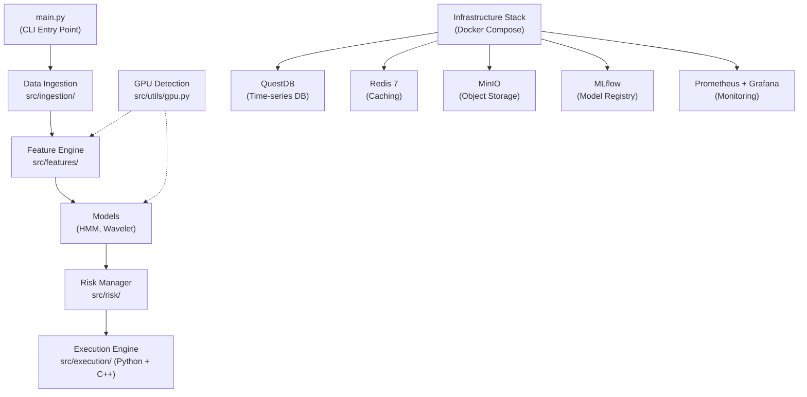

# 🏆 Project MINI-MEDALLION — Summary

> *A GPU-accelerated Gold (XAU) Trading Engine inspired by Jim Simons' Renaissance Technologies.*

---

## What Is It?

**Mini-Medallion** is an ambitious algorithmic trading system designed to trade **Gold (XAU)** using statistical methods inspired by Jim Simons and Renaissance Technologies. The core philosophy: *"We don't predict. We detect."* — finding repeatable, statistically significant patterns and exploiting them with computational speed.

---

## Current Status: **Phase 1 — ~95% Complete**

Phase 1 (Infrastructure & Compute) is nearly done. The codebase has the foundation laid but is **not yet trading** — production paths are placeholders.

---

## Architecture at a Glance

---

## Key Components

| Component | Location | Purpose |
|-----------|----------|---------|
| **CLI Entry Point** | `main.py` | Runs in 4 modes: `demo`, `backtest`, `paper`, `live` |
| **Data Ingestion** | `src/ingestion/` | Fetches gold price data (yfinance, synthetic fallback) |
| **Feature Engine** | `src/features/engine.py` | Generates technical indicators & features |
| **Wavelet Denoiser** | `src/models/wavelet.py` | Signal denoising via wavelet decomposition |
| **HMM Regime Detector** | `src/models/hmm_regime.py` | Detects bull/bear/sideways market regimes |
| **Risk Manager** | `src/risk/manager.py` | Kelly criterion sizing, circuit breakers |
| **Execution Engine** | `src/execution/` | Python skeleton + **C++ low-latency engine** |
| **GPU Utilities** | `src/utils/gpu.py` | CUDA/RAPIDS/cuDF detection & fallback |
| **Config** | `configs/base.yaml` | YAML-based configuration with env var substitution |

---

## Infrastructure Stack (Docker Compose — 6 Services)

| Service | Port(s) | Role |
|---------|---------|------|
| **QuestDB 7.4** | 9000, 9009, 8812 | Nanosecond-resolution time-series database |
| **Redis 7** | 6379 | In-memory caching + real-time signals |
| **MinIO** | 9100, 9101 | S3-compatible object storage for models/data |
| **MLflow** | 5000 | Experiment tracking & model registry |
| **Prometheus** | 9090 | Metrics collection |
| **Grafana** | 3000 | Visualization dashboards |

---

## C++ Execution Engine

A **low-latency trading engine** written in C++ for order execution:

- **OrderRouter** — Intelligent venue selection & order management
- **LatencyMonitor** — p50/p95/p99 latency percentile tracking
- **OrderBook** — Full L3 order book with bid/ask levels
- Cross-platform CMake build (Windows/Linux/macOS)

---

## 7-Phase Roadmap

| Phase | Name | Status |
|-------|------|--------|
| 1 | Infrastructure & Compute | 🟢 ~95% Done |
| 2 | Data Acquisition & Pipeline | 🔴 Not Started |
| 3 | Mathematical Modeling | 🔴 Not Started |
| 4 | Risk Management & Meta-Labeling | 🔴 Not Started |
| 5 | Backtesting & Validation | 🔴 Not Started |
| 6 | Paper Trading & Live Deployment | 🔴 Not Started |
| 7 | Team Culture & Operations | 🔴 Not Started |

---

## Tech Stack Summary

- **Language**: Python 3.11+ (primary) + C++ (execution engine)
- **GPU**: NVIDIA CUDA 12.1, RAPIDS cuDF/cuML, CuPy, PyTorch 2.2
- **Database**: QuestDB (time-series), Redis (cache), MinIO (objects)
- **ML Ops**: MLflow, scikit-learn, HMM (hmmlearn), PyWavelets
- **Infra**: Docker Compose, Prometheus, Grafana
- **CLI**: Click, Loguru

> [!IMPORTANT]
> The project is in **early infrastructure stage**. The demo pipeline works end-to-end with synthetic data, but real data ingestion, backtesting, and live trading are all future phases.
